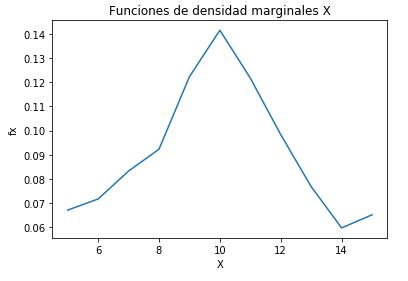
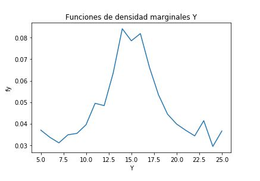
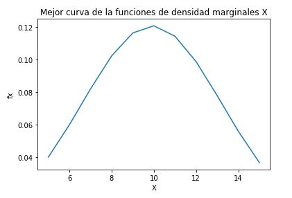
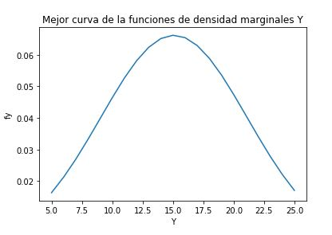
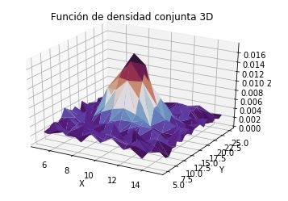

# Universidad de Costa Rica

### Facultad de Ingeniería

### Escuela de Ingeniería Eléctrica

#### IE0405 - Modelos Probabilísticos de Señales y Sistemas

#### Tarea 3

#### Leonel Castro Ulloa; B58219
#### 30 de junio del 2020

#### 1. A partir de los datos, encontrar la mejor curva de ajuste (modelo probabilístico) para las funciones de densidad marginales de X y Y.

Mediante la ayuda de la librería pandas se realiza la lectura de los datos, los cuales serán manipulados para obtener los vectores correspondientes para los ejes X y Y. Posteriormente se calcularon los vectores marginales respectivos por medio de sumar los valores de probabilidades para cada columna y fila, al obtener los vectores marginales se realizan las gráficas para observar que curva se ajusta mejor la cual en este caso fue el Gaussiano. 
Los vectores marginales obtenidos son:
Vector de densidad marginal de X: 9.90484381 3.29944288
Vector de densidad marginal de Y: 15.0794609   6.02693776
A continuación se mostraran las curvas marginales y las de mejor ajuste obtenidas:

#### 2. Asumir independencia de X y Y. Analíticamente, ¿cuál es entonces la expresión de la función de densidad conjunta que modela los datos?

Asumiendo la independecia de X y Y como se define en el enunciado, es posible obtener la funcion de densidad conjunta multiplicando las funciones de densidad marginales tanto de  X como de  Y, cuyo valor se encontro en el punto anterior, esto lo que nos va a mostrar como resulta la disposición de los valores de ambas densidades marginales. En otras palabras esta función permitira observar tanto la curva marginal que se obtuvo en X si se observa desde los ejes X,Z y se lograra observar la curva marginal de Y en el momento que se observa desde la perspectiva del eje YZ de una grafica 3D 

#### 3.Hallar los valores de correlación, covarianza y coeficiente de correlación (Pearson) para los datos y explicar su significado.

### Correlación:
La correlación corresponde a la proporcionalidad y la relación lineal que existe entre distintas variables, en otras palabras si los valores de una variable se modifican de manera sistemática con respecto a los valores de otra, se dice que ambas variables se encuentran correlacionada.
Un ejemplo simple para entender el concepto de correlación puede ser verlo como si en un super mercado se invierta una cantidad de dinero en mercaderia(gastos), este gasto debe de ser lineamente proporcional al aumento de la mercadería en el super mercado, la relación en la que aumentan ambas variables provoca la correlación.
El valor de correlación obtenido de los datos xyp.csv es de: 149.54281000000012.

### Covarianza
La covarianza es un valor estadístico que nos indica la variación producida por dos variables aleatorias que varían de forma conjunta respecto a sus medias, por lo tanto, sabremos cómo se comporta una variable dependiendo de cómo lo haga la otra.
Cuando la covarianza es menor que cero es debido a que X sube e Y baja, por lo que hay una relación negativa. De igual manera cuando la covarianza es mayor que cero se sabe que X sube y Y sube por lo tanto se puede decir que hay una relación positiva y por último cuando la covarianza  es igual que cero esto indica que no hay relación entre las variables X y Y.
El valor de covarianza obtenido de los datos xyp.csv es de: 0.183105046498099, por lo que la relación entre las variables es positiva.

### Coeficiente de correlación

El coeficiente de correlación es una medida de que permite cuantificar el grado de variación conjunta entre dos variables.Por lo que, es una medida estadística que presenta la dependencia lineal entre dos variables, es decir, se puede definir como el número que mide el grado de relación entre dos variables.
El valor del coeficiente de correlación obtenido de los datos xyp.csv es de: 0.009207950879217261, por lo tanto se puede vecir que la relación que existe entre lo valores es muy cercano por lo tanto los números no presentan una variación muy grande entre uno y otro.

#### 4. Graficar las funciones de densidad marginales (2D), la función de densidad conjunta (3D)

